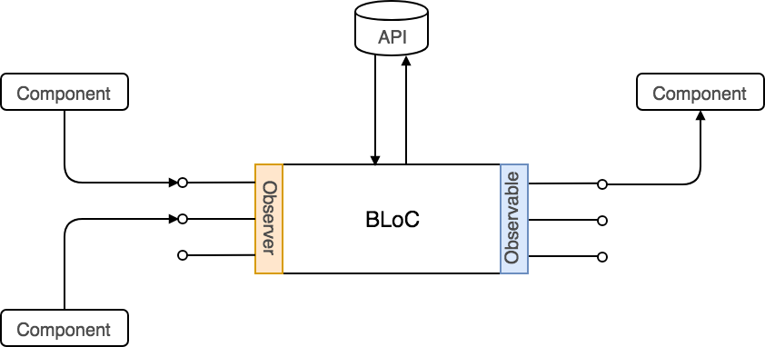

The **BLoC Pattern** has been designed by _Paolo Soares_ and _Cong Hui_, from
Google and first presented during the _DartConf 2018_ (January 23-24, 2018).
[See the video on YouTube](https://www.youtube.com/watch?v=PLHln7wHgPE 'BLoC Pattern Flutter') .

BLoC stands for **B**usiness **Lo**gic **C**omponent. Initially was conceived to
allow to reuse the same code between Flutter and Angular Dart, but in fact is
independently of the platform: web application, mobile application, back-end.

It can be considered an alternative to the
[Redux port for flutter](https://pub.dartlang.org/packages/flutter_redux 'Redux port for flutter') making
use of Dart streams. In our case we’re going to use Observables from the library
[RxJS](https://rxjs.dev/ 'RxJS') , but any other option like
[xstream](http://staltz.github.io/xstream/ 'xstream') will be valid as well.

In short the BLoC will:

- contain business logic (ideally in bigger applications we will have multiple BLoCs)
- rely _exclusively_ on the use of _Observables_ for both input (_Observer_) and output (_Observable_)
- remain _platform independent_
- remain _environment independent_

## How BLoC works?

I’m not going to explain extensively how BLoC works (there is other people that
did a better job I will do here), but just some basic hints.



The BLoC will hold the business logic and components will have no knowledge
about whats happening inside. Components will send _events_to the BLoC via
\_Observers_ and will be notified by the BLoC via _Observables_.

## Implementing the BLoC

This is basic typescript example of a search BLoC using RxJS:

```typescript
export class SearchBloc {
  private _results$: Observable<string[]>;
  private _preamble$: Observable<string>;
  private _query$ = new BehaviorSubject<string>('');

  constructor(private api: API) {
    this._results$ = this._query$.pipe(
      switchMap(query => {
        return observableFrom(this.api.search(query));
      })
    );
    this._preamble$ = this.results$.pipe(
      withLatestFrom(this._query$, (_, q) => {
        return q ? `Results for ${q}` : 'All results';
      })
    );
  }

  get results$(): Observable<string[]> {
    return this._results$;
  }

  get preamble$(): Observable<string> {
    return this._preamble$;
  }

  get query(): Observer<string> {
    return this._query$;
  }

  dispose() {
    this._query$.complete();
  }
}
```

`results$` and `preamble$` are exposed to be subscribed from a component and
they express asynchronous values that change in response to changes in `query`.

`query` is exposed as `Observer<string>` to the outside, to allow the addition
of new value from the components. Within `SearchBloc` , we have
`_query$: BehaviorSubject<string>` as the stream source, and the constructor
declares `_results$` and `_preamble$` to respond to `_query$`.

## Using it on React

In order to use it on React we need to create a new instance of the BLoC and
share it to the child components using a React context.

```jsx
const searchBloc = new SearchBloc(new API());
const SearchContext = React.createContext(bloc);
```

We have to expose it using the context provider:

```jsx
const App = () => {
  const searchBloc = useContext(SearchContext);

  useEffect(() => {
    return searchBloc.dispose;
  }, [searchBloc]);

  return (
    <SearchContext.Provider>
      <SearchInput />
      <ResultList />
    </SearchContext.Provider>
  );
};
```

It’s important to have the `useEffect` returning the dispose method of the BLoC
so it will complete the observer when the component is unmount.

Then we can publish changes to the BLoC from the `SearchInput` component:

```jsx
const SearchInput = () => {
   const searchBloc = useContext(SearchContext);
   const [query, setQuery] = useState("");

   useEffect(() => {
      searchBloc.query.next(query);
   }, [query]);

   return <input
            type="text"
            name="Search"
            value={query}
            onChange={({ target }) => setQuery(target.value)
          />;
}
```

We got the BLoC using the hook `useContext` and then with `useEffect` every time
the query change we publish the new value to the BLoC.

Now it’s time to the `ResultList`:

```jsx
const ResultList = () => {
  const searchBloc = useContext(SearchContext);
  const [results, setResults] = useState([]);

  useEffect(() => {
    return searchBloc.results$.subscribe(setResults);
  }, [searchBloc]);

  return (
    <div>
      {results.map(({ id, name }) => (
        <div key={id}>{name}</div>
      ))}
    </div>
  );
};
```

As before, we use the `useContext` to get the BLoC, but now in the `useEffect`
we subscribe the changes on the `results$` interface to update the local state
of the component. It’s important to return the return value of the subscribe,
since it will unsubscribe when the component is unmounted.

## Final thoughts

The final code is not complex, at least if you have a minimal knowledge about
_Observables_ and _hooks_. I have the feeling that the code is quite readable
and helps to keep the business logic outside the components. It’s true that we
should take care about to unsubscribe from the observables and dispose the BLoC
when the components are unmounted, but these issues could be easy solvable
creating some new hooks like `useBlocObservable` and `useBlocObserver`. But this
I’ll try in the future, soon I hope, in a side project I’m using this pattern.
