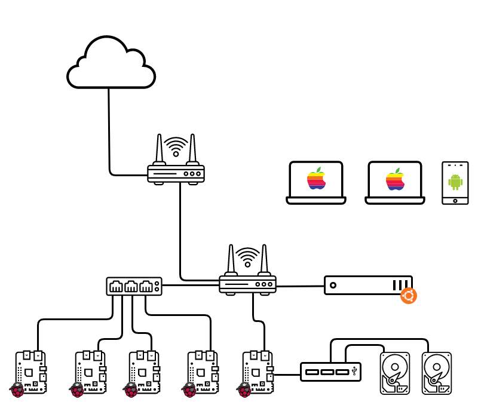

Due to the COVID-19, I’ve been closed at home 47 days already. Living alone in a small apartment with weekends full of nothing to do, it would be a good idea to fulfill that spare time trying to make my home more smart using [Home Assistant](https://www.home-assistant.io/hassio/) . It shouldn’t be difficult.

This is how everything started. During that process, my crazy brain told me: “You know side projects are for over-engineering”. So I decided to build something bigger, with multiple machines where I could schedule different jobs/containers and make it grow as I needed. I knew I could do something with the hardware I have at home: one old MacBook Air, an unused router & switch, and five different versions of Raspberry Pi. I had only one constraint, try to avoid spending more money on it.

## The starting point

These are the requirements I defined for my homelab:

- Don’t spend more money.
- Tolerance for machine failures (_the RPi’s are quite old I don’t trust them running 24/7_)
- Tolerance for disk failures (_same reason as for the RPi’s_)
- Be able to run almost every job without specifying which machine.
- Don’t spend more money (_writing it twice just to be sure)._

With requirements in place, this is the hardware:

- MacBook Air Mid-2012
- Raspberry Pi 4 Model B
- Raspberry Pi 3 Model B
- Raspberry Pi 2 Model B
- Raspberry Pi 1 Model B
- Raspberry Pi 1 Model A
- Wireless router TP-Link Archer C2600
- 5-Port Gigabit switch TP-LINK TL-SG105
- 4 hard drives of different sizes
- Some micro-sd cards with adaptors
- A bunch of network and USB cables
- Powered USB Hub
-

I put them all together in two pieces of wood in a way that can be placed under an IKEA shelving, so it is kind of hide from the view.

This is how it looks like:


## Installing operating systems

### Laptop

For the laptop I wanted some Linux with an easy installation and good documentation, because it has to be connected by wifi to the network (the MacBook Air doesn’t have Ethernet and the only USB to Ethernet adaptor I have is used on the Raspberry Pi 1 Model A).

Finally I went for Ubuntu Server 18.04. The installation was easy and guided that allowed me to install Docker during the process. The only configurations I had to do was: setup the wifi and disable suspend when the lid is close.

#### Configure WiFi connection

During all the installation process I used a USB to Ethernet adapter. Once the installation of Ubuntu finished its necessary to install `wpasupplicant`.

```
apt install wpasupplicant
```

Since Ubuntu 17.10, there is a new network configuration tool `netplan` by default. I found `netplan` easier to configure in computation to the previous experiences I had (long time ago to be honest).

During startup, `Netplan` reads all YAML files under `/etc/netplan/` so we just have to create a new one here `/etc/netplan/01-network-card.yaml`.

For static IP, change the **interface**, **static ip**, **gateway address**, **name servers** and **access point**accordingly. For DHCP, it can be done by setting `dhcp4: true` and removing the remaining.

```yaml
network:
  version: 2
  renderer: networkd
  wifis:
    wlp2s0b1: # name of the wireless interface
      dhcp4: no
      dhcp6: no
      addresses: [192.168.0.21/24] # static ip
      gateway4: 192.168.0.1 # router ip address
      nameservers:
        addresses: [192.168.0.1, 8.8.8.8] # DNS ip from ISP
      access-points:
        “network_ssid_name”: # WiFi SSID
          password: “**********” # WiFi password
```

Once the file is saved, execute the commands below:

```
netplan generate
netplan apply
```

The interface will be turned on and connected to the wireless network (keep in mind that this could take some time). It can be checked with `ifconfig.` Also, when the machine startup, it will automatically connected to the chosen wireless network.

#### Disable suspend on lid close

This is the other problem I found. Since the laptop is gonna a be 99.99% of the time with the lid close it’s an issue. But the solution is quite easy. I only had to edit the file `/etc/systemd/logind.conf` adding a new line with:

```
HandleLidSwitch=ignore
```

And finally just restart the service executing:

```
systemctl restart systemd-logind.service
```

### Raspberry Pi

For the Raspberries I had to do some research. The objective is run docker containers in any of the machines, and I have a wide variety of Raspberries. I found the [HypriotOS project](https://blog.hypriot.com/) , an operative system for ARM machines with docker installed with support for Raspberry Pi 1, 2, 3, 4 and Zero.

I was quite easy to install on all the Raspberries thanks to their [flash tool](https://github.com/hypriot/flash) that allows you to specify a cloud-init file as you will do in a cloud provider like AWS or Google Cloud.

## Network

No fixed IP’s (at least for now)

mDNS

### Network diagram



## Task scheduler: Nomad & Consul

Auto discover of the machines in Consul using mDNS

Setup of nomad is easy since it just works very well with Consul.

## Metrics

node_exporter

## What’s next?

- OpenFaaS
- AdguardHome or PiHole
- HomeAssistant
- Object Storage Service (S3 compatible)
- Auto backup of the machines
- Software defined network
- Traefik

## References

- [Install Ubuntu Server 18.04 into my old X200 labtop — connect WiFi during startup](https://medium.com/@kokit/install-ubuntu-server-18-04-into-my-old-x200-labtop-connect-wifi-during-startup-d6d305e4d58a)
- [Bootstrapping a Cloud with Cloud-Init and HypriotOS · Docker Pirates ARMed with explosive stuff](https://blog.hypriot.com/post/cloud-init-cloud-on-hypriot-x64/)
